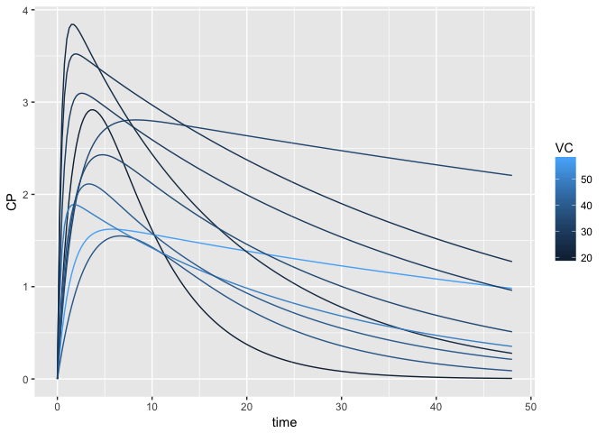
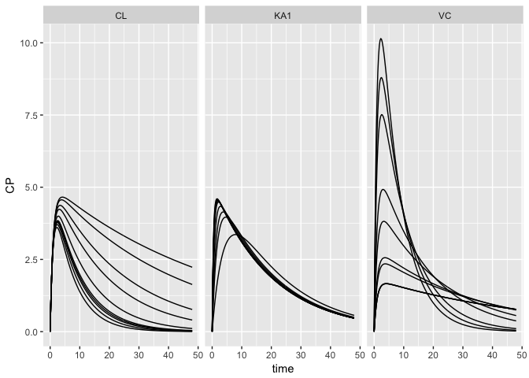
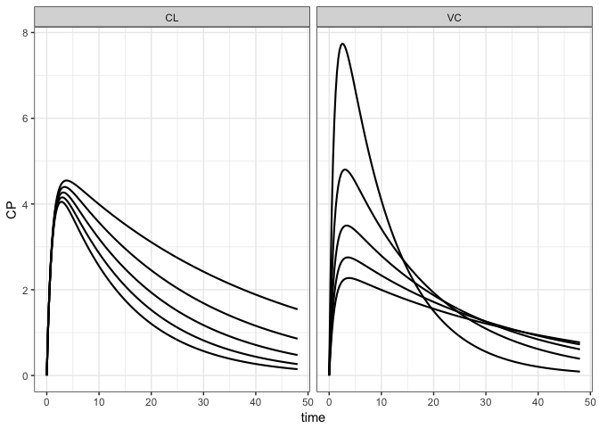
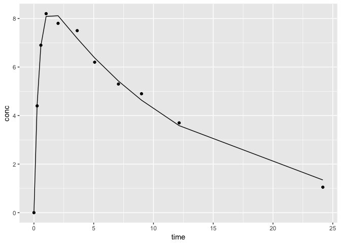

mrgsolvetk
==========

A toolkit to be used with `mrgsolve`

Examples
========

``` r
library(ggplot2)
library(dplyr)
library(mrgsolve)
library(mrgsolvetk)

mod <- mread_cache("pk1cmt",modlib())

mod <- ev(mod, amt=100) %>% Req(CP) %>% update(end = 48, delta = 0.25)

param(mod)
```

    . 
    .  Model parameters (N=6):
    .  name value . name value
    .  CL   1     | KM   2    
    .  KA1  1     | VC   20   
    .  KA2  1     | VMAX 0

Sensitivity analyses
--------------------

### `sens_unif`

-   Draw parameters from uniform distribution based on current parameter values
-   `lower` and `upper` scale the parameter value to provide `a` and `b` arguments to `runif`

``` r
out <- 
  mod %>% 
  select(CL,VC,KA1) %>%
  sens_unif(.n=10, lower=0.2, upper=3)

out
```

    . # A tibble: 1,930 x 8
    .       ID  time    CP    CL    VC   KA1 name         value
    .    <dbl> <dbl> <dbl> <dbl> <dbl> <dbl> <chr>        <dbl>
    .  1  1.00 0      0     2.33  24.9  2.26 multivariate  1.00
    .  2  1.00 0.250  1.71  2.33  24.9  2.26 multivariate  1.00
    .  3  1.00 0.500  2.64  2.33  24.9  2.26 multivariate  1.00
    .  4  1.00 0.750  3.13  2.33  24.9  2.26 multivariate  1.00
    .  5  1.00 1.00   3.38  2.33  24.9  2.26 multivariate  1.00
    .  6  1.00 1.25   3.48  2.33  24.9  2.26 multivariate  1.00
    .  7  1.00 1.50   3.50  2.33  24.9  2.26 multivariate  1.00
    .  8  1.00 1.75   3.47  2.33  24.9  2.26 multivariate  1.00
    .  9  1.00 2.00   3.43  2.33  24.9  2.26 multivariate  1.00
    . 10  1.00 2.25   3.37  2.33  24.9  2.26 multivariate  1.00
    . # ... with 1,920 more rows

``` r
ggplot(out, aes(time, CP, group = ID, col = VC)) + geom_line()
```



We can also make a univariate version of this

``` r
out <- 
  mod %>% 
  select(CL,VC,KA1) %>%
  sens_unif(.n=10, lower=0.2, upper=3, univariate = TRUE)

out
```

    . # A tibble: 5,790 x 5
    .       ID  time    CP name  value
    .    <dbl> <dbl> <dbl> <chr> <dbl>
    .  1  1.00 0      0    CL     1.90
    .  2  1.00 0.250  1.09 CL     1.90
    .  3  1.00 0.500  1.92 CL     1.90
    .  4  1.00 0.750  2.54 CL     1.90
    .  5  1.00 1.00   2.99 CL     1.90
    .  6  1.00 1.25   3.32 CL     1.90
    .  7  1.00 1.50   3.56 CL     1.90
    .  8  1.00 1.75   3.72 CL     1.90
    .  9  1.00 2.00   3.82 CL     1.90
    . 10  1.00 2.25   3.88 CL     1.90
    . # ... with 5,780 more rows

``` r
ggplot(out, aes(time, CP, group = ID)) + 
  geom_line() + facet_wrap(~name)
```



### `sens_norm`

-   Draw parameters from (log) normal distribution based on current parameter values and `%CV`

``` r
mod %>% 
  select(CL,VC) %>%
  sens_norm(.n=10, cv=30)
```

    . # A tibble: 1,930 x 7
    .       ID  time    CP    CL    VC name         value
    .    <dbl> <dbl> <dbl> <dbl> <dbl> <chr>        <dbl>
    .  1  1.00 0     0      1.74  35.1 multivariate  1.00
    .  2  1.00 0.250 0.627  1.74  35.1 multivariate  1.00
    .  3  1.00 0.500 1.11   1.74  35.1 multivariate  1.00
    .  4  1.00 0.750 1.47   1.74  35.1 multivariate  1.00
    .  5  1.00 1.00  1.75   1.74  35.1 multivariate  1.00
    .  6  1.00 1.25  1.96   1.74  35.1 multivariate  1.00
    .  7  1.00 1.50  2.12   1.74  35.1 multivariate  1.00
    .  8  1.00 1.75  2.23   1.74  35.1 multivariate  1.00
    .  9  1.00 2.00  2.31   1.74  35.1 multivariate  1.00
    . 10  1.00 2.25  2.37   1.74  35.1 multivariate  1.00
    . # ... with 1,920 more rows

### `sens_seq`

-   Give a sequence for one or more parameters

``` r
mod %>% sens_seq(CL = seq(2,12,2), VC = seq(30,100,10))
```

    . # A tibble: 2,716 x 5
    .       ID  time    CP name  value
    .    <dbl> <dbl> <dbl> <chr> <dbl>
    .  1  1.00 0      0    CL     2.00
    .  2  1.00 0      0    CL     2.00
    .  3  1.00 0.250  1.09 CL     2.00
    .  4  1.00 0.500  1.91 CL     2.00
    .  5  1.00 0.750  2.53 CL     2.00
    .  6  1.00 1.00   2.98 CL     2.00
    .  7  1.00 1.25   3.31 CL     2.00
    .  8  1.00 1.50   3.54 CL     2.00
    .  9  1.00 1.75   3.70 CL     2.00
    . 10  1.00 2.00   3.80 CL     2.00
    . # ... with 2,706 more rows

### `sens_spaced`

-   Create sets of parameters equally-spaced between two bounds

``` r
mod %>%
  select(CL,VC) %>%
  sens_spaced(.n = 5, .factor = 4)
```

    . # A tibble: 1,930 x 5
    .       ID  time    CP name  value
    .    <dbl> <dbl> <dbl> <chr> <dbl>
    .  1  1.00 0      0    CL    0.250
    .  2  1.00 0.250  1.10 CL    0.250
    .  3  1.00 0.500  1.96 CL    0.250
    .  4  1.00 0.750  2.62 CL    0.250
    .  5  1.00 1.00   3.14 CL    0.250
    .  6  1.00 1.25   3.53 CL    0.250
    .  7  1.00 1.50   3.84 CL    0.250
    .  8  1.00 1.75   4.07 CL    0.250
    .  9  1.00 2.00   4.25 CL    0.250
    . 10  1.00 2.25   4.39 CL    0.250
    . # ... with 1,920 more rows

or

``` r
out <- 
  mod %>%
  sens_spaced(CL = c(0.5, 1.5), VC = c(10,40), .n = 5)

ggplot(out, aes(time,CP, group = ID)) + geom_line() + facet_wrap(~name)
```



### `sens_grid`

-   Like `sens_seq` but performs all combinations

``` r
mod %>%  sens_grid(CL = seq(1,10,1), VC = seq(20,40,5))
```

    . # A tibble: 9,650 x 7
    .       ID  time    CP    CL    VC name         value
    .    <dbl> <dbl> <dbl> <dbl> <dbl> <chr>        <dbl>
    .  1  1.00 0      0     1.00  20.0 multivariate  1.00
    .  2  1.00 0.250  1.10  1.00  20.0 multivariate  1.00
    .  3  1.00 0.500  1.94  1.00  20.0 multivariate  1.00
    .  4  1.00 0.750  2.58  1.00  20.0 multivariate  1.00
    .  5  1.00 1.00   3.07  1.00  20.0 multivariate  1.00
    .  6  1.00 1.25   3.44  1.00  20.0 multivariate  1.00
    .  7  1.00 1.50   3.71  1.00  20.0 multivariate  1.00
    .  8  1.00 1.75   3.91  1.00  20.0 multivariate  1.00
    .  9  1.00 2.00   4.05  1.00  20.0 multivariate  1.00
    . 10  1.00 2.25   4.15  1.00  20.0 multivariate  1.00
    . # ... with 9,640 more rows

### `sens_covset`

-   Use `dmutate` to generate random variates for each parameter

``` r
cov1 <- dmutate::covset(CL ~ runif(1,3.5), VC[0,] ~ rnorm(50,25))

cov1
```

    .  Formulae                 
    .    CL ~ runif(1, 3.5)     
    .    VC[0, ] ~ rnorm(50, 25)

``` r
out <- mod %>% sens_covset(cov1) 
```

``` r
out
```

    . # A tibble: 19,300 x 7
    .       ID  time    CP    CL    VC name         value
    .    <dbl> <dbl> <dbl> <dbl> <dbl> <chr>        <dbl>
    .  1  1.00 0     0      2.51  67.1 multivariate  1.00
    .  2  1.00 0.250 0.328  2.51  67.1 multivariate  1.00
    .  3  1.00 0.500 0.581  2.51  67.1 multivariate  1.00
    .  4  1.00 0.750 0.774  2.51  67.1 multivariate  1.00
    .  5  1.00 1.00  0.922  2.51  67.1 multivariate  1.00
    .  6  1.00 1.25  1.03   2.51  67.1 multivariate  1.00
    .  7  1.00 1.50  1.12   2.51  67.1 multivariate  1.00
    .  8  1.00 1.75  1.18   2.51  67.1 multivariate  1.00
    .  9  1.00 2.00  1.23   2.51  67.1 multivariate  1.00
    . 10  1.00 2.25  1.26   2.51  67.1 multivariate  1.00
    . # ... with 19,290 more rows

``` r
distinct(out,ID,CL,VC)
```

    . # A tibble: 100 x 3
    .       ID    CL    VC
    .    <dbl> <dbl> <dbl>
    .  1  1.00  2.51  67.1
    .  2  2.00  2.28  36.4
    .  3  3.00  3.08  32.2
    .  4  4.00  1.29  34.2
    .  5  5.00  3.37  56.0
    .  6  6.00  1.09  10.5
    .  7  7.00  2.85  28.7
    .  8  8.00  1.66  19.4
    .  9  9.00  2.33  24.9
    . 10 10.0   1.18  29.0
    . # ... with 90 more rows

Estimation `stats::optim`
=========================

Load a data set
---------------

``` r
data(exTheoph)
df <- mutate(exTheoph, DV = conc)
```

Load a model
------------

``` r
mod <- mread("pk1cmt", modlib())
```

Define an objective function
----------------------------

-   This could be anything

``` r
ofv <- function(dv,pred,par) -1*sum(dnorm(dv,pred,par$sigma,log=TRUE))
```

Define parameters to estimate
-----------------------------

``` r
library(optimhelp)
par <- parset(log_par("CL", 0.1),
              log_par("VC", 1.1),
              log_par("KA1",1.1),
              log_par("sigma",1))
```

Fit
---

-   The workflow is the same as when we simulate
-   Get the model ready
-   Define the dta set
-   Pipe to `fit_optim` rather than `mrgsim`
-   Here, just fit `ID==3`

``` r
fit <- 
  mod %>% 
  data_set(df, ID==3) %>%
  fit_optim(pred="CP",ofv=ofv,par=par)
```

``` r
fit$pars
```

    .   name     value transf tr fx
    .     CL 0.0395583    log  u   
    .     VC 0.4858379    log  u   
    .    KA1 2.4536472    log  u   
    .  sigma 0.2089564    log  u

Plot
----

``` r
library(ggplot2)
ggplot(data=fit$tab) + 
  geom_point(aes(time,conc)) +
  geom_line(aes(time,PRED)) 
```



With fixed parameter
--------------------

``` r
library(optimhelp)
par <- parset(log_par("CL", 0.1),
              log_par("VC", 1.1),
              log_par("KA1",1.9,fixed=TRUE),
              log_par("sigma",1))
```

Fit
---

``` r
fitt <- 
  mod %>% 
  data_set(df, ID==3) %>%
  fit_optim(pred="CP",ofv=ofv,par=par)
```

``` r
fitt$pars
```

    .   name      value transf tr fx
    .     CL 0.04190059    log  u   
    .     VC 0.45512514    log  u   
    .    KA1 1.90000000    log  u  *
    .  sigma 0.35140850    log  u

``` r
fit$value
```

    . [1] -1.470963

``` r
fitt$value
```

    . [1] 3.732531
