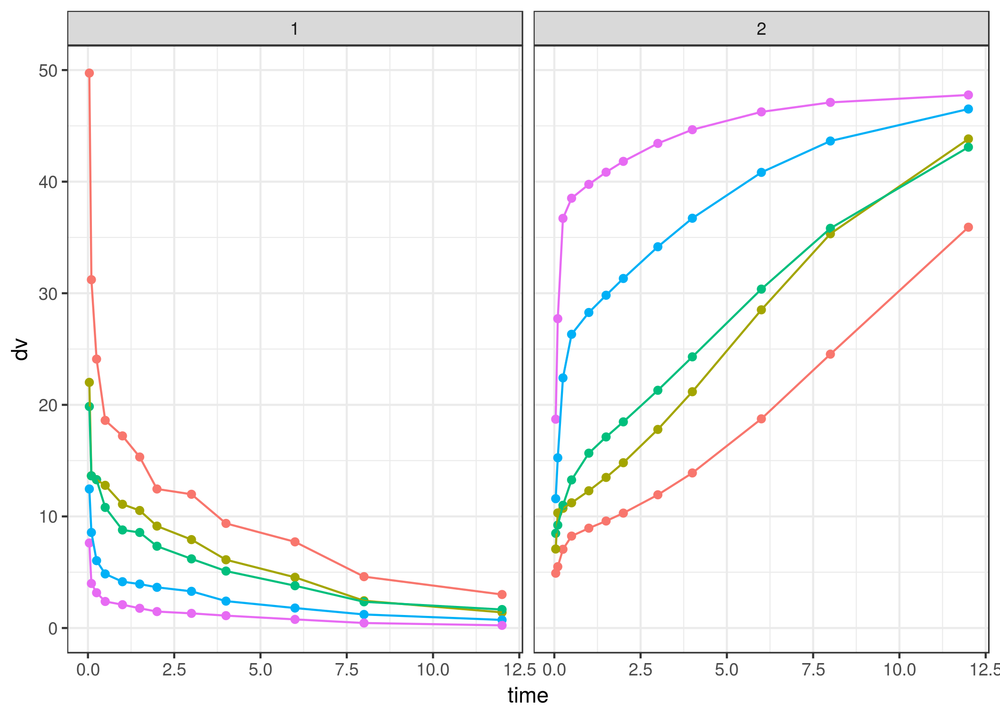

mrgsolvetk
==========

A toolkit to be used with `mrgsolve`

Examples
========

``` r
library(dplyr)
library(mrgsolve)
library(mrgsolvetk)

mod <- mread_cache("pk1cmt",modlib())
mod <- ev(mod, amt=100) %>% Req(CP)

param(mod)
```

    . 
    .  Model parameters (N=6):
    .  name value . name value
    .  CL   1     | KM   2    
    .  KA1  1     | VC   20   
    .  KA2  1     | VMAX 0

Sensitivity analyses
--------------------

### `sens_unif`

-   Draw parameters from uniform distribution based on current parameter values
-   `lower` and `upper` scale the parameter value to provide `a` and `b` arguments to `runif`

``` r
mod %>% sens_unif(n=10, pars="CL,VC,KA1", lower=0.2, upper=3)
```

    . # A tibble: 250 × 7
    .       ID  time    .n       CP       CL       VC    KA1
    .    <dbl> <dbl> <dbl>    <dbl>    <dbl>    <dbl>  <dbl>
    . 1      1     0     1 0.000000 2.961108 15.10761 1.8178
    . 2      1     1     1 4.893875 2.961108 15.10761 1.8178
    . 3      1     2     1 4.817501 2.961108 15.10761 1.8178
    . 4      1     3     1 4.089083 2.961108 15.10761 1.8178
    . 5      1     4     1 3.382226 2.961108 15.10761 1.8178
    . 6      1     5     1 2.783631 2.961108 15.10761 1.8178
    . 7      1     6     1 2.288729 2.961108 15.10761 1.8178
    . 8      1     7     1 1.881451 2.961108 15.10761 1.8178
    . 9      1     8     1 1.546588 2.961108 15.10761 1.8178
    . 10     1     9     1 1.271316 2.961108 15.10761 1.8178
    . # ... with 240 more rows

### `sens_norm`

-   Draw parameters from (log) normal distribution based on current parameter values and `%CV`

``` r
mod %>% sens_norm(n=10, pars="CL,VC", cv=30)
```

    . # A tibble: 250 × 6
    .       ID  time    .n       CP       CL       VC
    .    <dbl> <dbl> <dbl>    <dbl>    <dbl>    <dbl>
    . 1      1     0     1 0.000000 1.075999 28.32558
    . 2      1     1     1 2.182955 1.075999 28.32558
    . 3      1     2     1 2.904651 1.075999 28.32558
    . 4      1     3     1 3.091813 1.075999 28.32558
    . 5      1     4     1 3.085250 1.075999 28.32558
    . 6      1     5     1 3.010232 1.075999 28.32558
    . 7      1     6     1 2.912736 1.075999 28.32558
    . 8      1     7     1 2.809577 1.075999 28.32558
    . 9      1     8     1 2.706842 1.075999 28.32558
    . 10     1     9     1 2.606678 1.075999 28.32558
    . # ... with 240 more rows

### `sens_seq`

-   Give a sequence for one or more parameters

``` r
mod %>% sens_seq(CL = seq(2,12,2), VC = seq(30,100,10))
```

    . # A tibble: 364 × 6
    .       ID  time    .n       CP param value
    .    <dbl> <dbl> <dbl>    <dbl> <chr> <dbl>
    . 1      1     0     1 0.000000    CL     2
    . 2      1     0     1 0.000000    CL     2
    . 3      1     1     1 2.983100    CL     2
    . 4      1     2     1 3.796642    CL     2
    . 5      1     3     1 3.839062    CL     2
    . 6      1     4     1 3.622247    CL     2
    . 7      1     5     1 3.332182    CL     2
    . 8      1     6     1 3.035183    CL     2
    . 9      1     7     1 2.753741    CL     2
    . 10     1     8     1 2.494408    CL     2
    . # ... with 354 more rows

### `sens_grid`

-   Like `sens_seq` but performs all combinations

``` r
mod %>%  sens_grid(CL = seq(1,10,1), VC = seq(20,40,5))
```

    . # A tibble: 1,300 × 6
    .       ID  time    .n    CL    VC       CP
    .    <dbl> <dbl> <dbl> <dbl> <dbl>    <dbl>
    . 1      1     0     1     1    20 0.000000
    . 2      1     0     1     1    20 0.000000
    . 3      1     1     1     1    20 3.070263
    . 4      1     2     1     1    20 4.050011
    . 5      1     3     1     1    20 4.268005
    . 6      1     4     1     1    20 4.212711
    . 7      1     5     1     1    20 4.063489
    . 8      1     6     1     1    20 3.885997
    . 9      1     7     1     1    20 3.704085
    . 10     1     8     1     1    20 3.526235
    . # ... with 1,290 more rows

### `sens_covset`

-   Use `dmutate` to generate random variates for each parameter

``` r
cov1 <- dmutate::covset(CL ~ runif(1,3.5), VC[0,] ~ rnorm(50,25))

cov1
```

    .  Formulae                 
    .    CL ~ runif(1, 3.5)     
    .    VC[0, ] ~ rnorm(50, 25)

``` r
out <- mod %>% sens_covset(cov1) 
```

``` r
out
```

    . # A tibble: 2,500 × 5
    .       ID  time       CL       VC        CP
    .    <dbl> <dbl>    <dbl>    <dbl>     <dbl>
    . 1      1     0 2.926245 82.29621 0.0000000
    . 2      1     1 2.926245 82.29621 0.7524104
    . 3      1     2 2.926245 82.29621 1.0029229
    . 4      1     3 2.926245 82.29621 1.0697158
    . 5      1     4 2.926245 82.29621 1.0698080
    . 6      1     5 2.926245 82.29621 1.0462175
    . 7      1     6 2.926245 82.29621 1.0147400
    . 8      1     7 2.926245 82.29621 0.9811574
    . 9      1     8 2.926245 82.29621 0.9475690
    . 10     1     9 2.926245 82.29621 0.9147203
    . # ... with 2,490 more rows

``` r
distinct(out,ID,CL,VC)
```

    . # A tibble: 100 × 3
    .       ID       CL       VC
    .    <dbl>    <dbl>    <dbl>
    . 1      1 2.926245 82.29621
    . 2      2 2.336479 32.33790
    . 3      3 2.063311 37.92208
    . 4      4 2.429848 16.85905
    . 5      5 1.676048 83.66946
    . 6      6 1.460409 29.25081
    . 7      7 1.118386 48.90828
    . 8      8 1.118439 18.57876
    . 9      9 1.543191 34.33443
    . 10    10 3.273260 67.30763
    . # ... with 90 more rows

Estimation `stats::optim`
=========================

Load a data set
---------------

``` r
data(exTheoph)
df <- as.data.frame(exTheoph)
id1 <- filter(df, ID==3) %>% mutate(DV = conc)
```

Load a model
------------

``` r
mod <- mread("pk1cmt", modlib())
```

Define an objective function
----------------------------

``` r
ofv <- function(dv,pred,par) {
  a <- sum((dv-pred)^2) 
  return(a)
}
```

Define parameters to estimate
-----------------------------

``` r
library(optimhelp)
par <- parset(log_par("CL", 0.1),
              log_par("VC", 1.1),
              log_par("KA1",1.1))
```

Fit
---

``` r
fit <- 
  mod %>% 
  data_set(id1) %>%
  fit_optim(pred="CP",.ofv=ofv,par=par)
```

``` r
exp(fit$par)
```

    .        CL        VC       KA1 
    . 0.0395555 0.4858391 2.4537226

Plot
----

``` r
library(ggplot2)
ggplot(data=fit$tab) + 
  geom_point(aes(time,conc)) +
  geom_line(aes(time,PRED)) 
```


