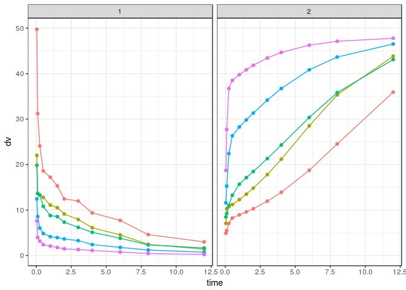
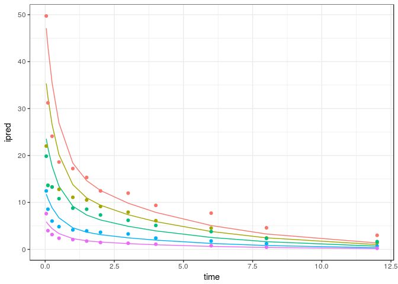
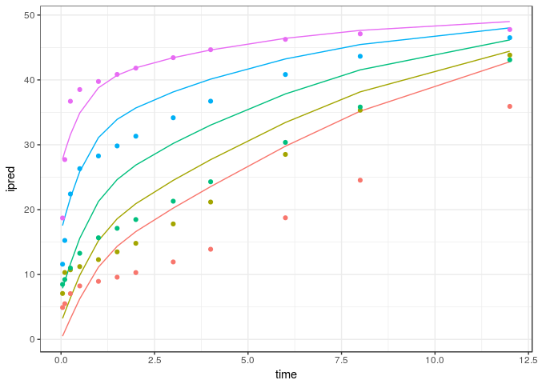
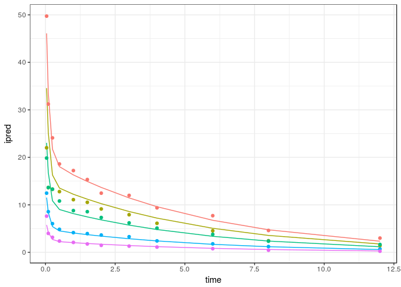
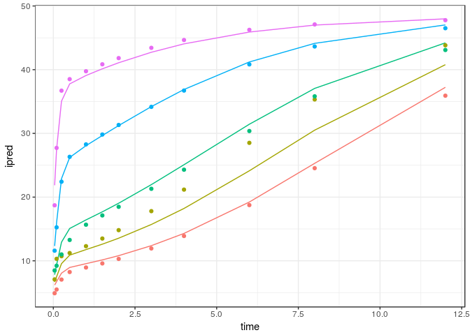

mrgoptim
==========

A toolkit to be used with `mrgsolve` for optimization of model parameters.

Installation
============

``` r
library(devtools)
install_github("mhismail/mrgoptim")
```

Examples
========

-   [Parameter Optimization](#maximum-likelihood-parameter-optimization)

Maximum Likelihood Parameter Optimization
-----------------------------------------

### `mrgoptim`

This example shows a simultaneous fit of PK and PD data from five dose levels.

#### Data structure

The data to be fit is an mrgsolve dataset. Required columns for fitting are:

-   ID
-   time
-   evid
-   cmt
-   amt
-   dv

``` r
data <- read.csv("inst/maintenance/data/optim-example.csv")

head(data)
```

    .   ID time cmt evid       dv  amt
    . 1  1 0.00   1    1       NA 1000
    . 2  1 0.04   1    0 49.73123   NA
    . 3  1 0.04   2    0  4.91075   NA
    . 4  1 0.10   1    0 31.21634   NA
    . 5  1 0.10   2    0  5.49637   NA
    . 6  1 0.25   1    0 24.10030   NA

Plot the data to get an idea of the profiles to be fit. cmt 1 is plasma concentration data and cmt 2 is PD data

``` r
ggplot(data, aes(x = time, y = dv, color = as.factor(ID))) +
  geom_point() +
  geom_line() +
  facet_wrap("cmt") +
  guides(color = FALSE)
```



The following model will be fit to these data:

-   PK: 2 compartment model
-   PD: Inhibitory Emax model with baseline
-   Proportional error models for both PK and PD

``` r
code<-"
$PROB 2 cmt PK Model, Emax PD model

$PARAM
CL=10
VC = 20
VP = 20
Q=20
Emax = 60
BL = 50
EC50 = 10
gamma =1
sigma1 = 0.1
sigma2 = 0.1

$CMT X1 X2 

$ODE
dxdt_X1 = -(Q+CL)/VC*X1+Q/VP*X2;
dxdt_X2 = Q/VC*X1-Q/VP*X2;

$TABLE
capture PK = X1/VC;
capture varPK = (PK*sigma1)*(PK*sigma1);


capture PD = BL-(pow(PK,gamma)*Emax)/(pow(PK,gamma)+pow(EC50,gamma));
capture varPD = (PD*sigma2)*(PD*sigma2);

capture ipred = NAN;
capture var = NAN; 


if(self.cmt == 1) {
   ipred = PK;
   var = varPK;
}

if(self.cmt == 2) {
   ipred = PD;
   var = varPD;
}"

mod <- mcode("2cmtPK-Emax", code)
```

Here, the predicted plasma concentrations, response, and variances were captured in the **PK**, **PD**, **varPK**, and **varPD** outputs, respectively. Predictions and variances are consolidated to a single column each. If cmt == 1 the predicted output, `ipred`, will be PK and prediction variance, `var`, varPK. If cmt == 2 the predicted output will be PD and prediction variance varPD.

Let's check how the initial parameter values fit the data.

``` r
out <- mod %>%
  data_set(data) %>%
  carry.out(cmt, dv) %>%
  obsonly() %>%
  mrgsim() %>%
  as.data.frame()

ggplot(filter(out, cmt == 1), aes(x = time, y = ipred, color = as.factor(ID))) +
  geom_line() +
  geom_point(aes(y = dv)) +
  guides(color = FALSE)
```



``` r
ggplot(filter(out, cmt == 2), aes(x = time, y = ipred, color = as.factor(ID))) +
  geom_line() +
  geom_point(aes(y = dv)) +
  guides(color = FALSE)
```



Not terrible, should be good enough for initial estimates.

Now let's use `mrgoptim` to optimize the parameters and return parameter values and precision. Use the `output`, and `var` arguments to specify which columns in the model code correspond to the predicted values and variances. Specify which system parameters to optimize with the `prms` argument and variance parameters with the `v_prms` arguments.

``` r
fit <- mod %>%
  data_set(data) %>%
  mrgoptim(output = "ipred",
           var = "var",
           prms = c("CL",
                    "VC",
                    "VP",
                    "Q",
                    "Emax",
                    "BL",
                    "EC50",
                    "gamma"),
           v_prms = c("sigma1", "sigma2"),
           method = "newuoa")
```

The function returns a list with some information about the optimization, the final objective function value (-LL), final parameter estimates, covariance and correlation matrices, CV percent, and output dataset.

``` r
print(fit)
```

    . $par
    .           CL           VC           VP            Q         Emax 
    .   8.75373026  16.72026061  31.25670528 107.80938229  42.98965084 
    .           BL         EC50        gamma       sigma1       sigma2 
    .  48.42448862   4.33966995   1.69630917   0.15724999   0.08954397 
    . 
    . $fval
    . [1] 194.7881
    . 
    . $feval
    . [1] 4853
    . 
    . $ierr
    . [1] 0
    . 
    . $msg
    . [1] "Normal exit from newuoa"
    . 
    . $cov
    .                [,1]          [,2]          [,3]          [,4]
    .  [1,]  4.050254e-02  3.319504e-02  6.356155e-02  2.402288e-01
    .  [2,]  3.319504e-02  1.870666e+00 -1.321098e+00 -1.095217e+01
    .  [3,]  6.356155e-02 -1.321098e+00  2.732482e+00  9.718232e+00
    .  [4,]  2.402288e-01 -1.095217e+01  9.718232e+00  1.578101e+02
    .  [5,] -2.106478e-03  1.679978e-01 -2.395963e-01  2.567654e-02
    .  [6,] -2.375067e-03  1.133761e-01 -1.283697e-01 -2.769804e-01
    .  [7,] -1.543825e-02 -3.406453e-02 -6.295146e-02 -4.753888e-02
    .  [8,] -1.393394e-03 -6.280719e-03  2.534692e-02  6.536450e-03
    .  [9,]  5.673031e-04  1.083587e-03  2.025655e-03  6.986798e-03
    . [10,] -1.240847e-10 -9.252575e-10  1.400150e-09  4.637098e-09
    .                [,5]          [,6]          [,7]          [,8]
    .  [1,] -2.106478e-03 -2.375067e-03 -1.543825e-02 -1.393394e-03
    .  [2,]  1.679978e-01  1.133761e-01 -3.406453e-02 -6.280719e-03
    .  [3,] -2.395963e-01 -1.283697e-01 -6.295146e-02  2.534692e-02
    .  [4,]  2.567654e-02 -2.769804e-01 -4.753888e-02  6.536450e-03
    .  [5,]  5.136528e+00  4.429163e+00 -5.655071e-01 -2.385901e-01
    .  [6,]  4.429163e+00  3.970299e+00 -5.239931e-01 -1.875052e-01
    .  [7,] -5.655071e-01 -5.239931e-01  9.221572e-02  2.623165e-02
    .  [8,] -2.385901e-01 -1.875052e-01  2.623165e-02  1.640934e-02
    .  [9,] -1.981223e-09 -1.024343e-09 -2.812404e-04  3.630618e-10
    . [10,] -5.144395e-04 -5.794714e-04  1.801624e-09  9.501174e-10
    .                [,9]         [,10]
    .  [1,]  5.673031e-04 -1.240847e-10
    .  [2,]  1.083587e-03 -9.252575e-10
    .  [3,]  2.025655e-03  1.400150e-09
    .  [4,]  6.986798e-03  4.637097e-09
    .  [5,] -1.981223e-09 -5.144395e-04
    .  [6,] -1.024343e-09 -5.794714e-04
    .  [7,] -2.812404e-04  1.801624e-09
    .  [8,]  3.630618e-10  9.501174e-10
    .  [9,]  2.162539e-04 -1.058478e-12
    . [10,] -1.058478e-12  6.788920e-05
    . 
    . $cor
    .                [,1]          [,2]          [,3]          [,4]
    .  [1,]  1.000000e+00  1.205963e-01  1.910622e-01  9.502032e-02
    .  [2,]  1.205963e-01  1.000000e+00 -5.843302e-01 -6.374333e-01
    .  [3,]  1.910622e-01 -5.843302e-01  1.000000e+00  4.679950e-01
    .  [4,]  9.502032e-02 -6.374333e-01  4.679950e-01  1.000000e+00
    .  [5,] -4.618288e-03  5.419641e-02 -6.395382e-02  9.018502e-04
    .  [6,] -5.922745e-03  4.160175e-02 -3.897375e-02 -1.106547e-02
    .  [7,] -2.526122e-01 -8.201659e-02 -1.254078e-01 -1.246175e-02
    .  [8,] -5.404895e-02 -3.584807e-02  1.197019e-01  4.061898e-03
    .  [9,]  1.916867e-01  5.387455e-02  8.333064e-02  3.782064e-02
    . [10,] -7.483017e-08 -8.210397e-08  1.028006e-07  4.480006e-08
    .                [,5]          [,6]          [,7]          [,8]
    .  [1,] -4.618288e-03 -5.922745e-03 -2.526122e-01 -5.404895e-02
    .  [2,]  5.419641e-02  4.160175e-02 -8.201659e-02 -3.584807e-02
    .  [3,] -6.395382e-02 -3.897375e-02 -1.254078e-01  1.197019e-01
    .  [4,]  9.018502e-04 -1.106547e-02 -1.246175e-02  4.061898e-03
    .  [5,]  1.000000e+00  9.807883e-01 -8.216763e-01 -8.218114e-01
    .  [6,]  9.807883e-01  1.000000e+00 -8.659872e-01 -7.346088e-01
    .  [7,] -8.216763e-01 -8.659872e-01  1.000000e+00  6.743379e-01
    .  [8,] -8.218114e-01 -7.346088e-01  6.743379e-01  1.000000e+00
    .  [9,] -5.944517e-08 -3.495842e-08 -6.297863e-02  1.927317e-07
    . [10,] -2.754858e-02 -3.529556e-02  7.200479e-07  9.001843e-07
    .                [,9]         [,10]
    .  [1,]  1.916867e-01 -7.483017e-08
    .  [2,]  5.387455e-02 -8.210396e-08
    .  [3,]  8.333064e-02  1.028006e-07
    .  [4,]  3.782064e-02  4.480005e-08
    .  [5,] -5.944518e-08 -2.754858e-02
    .  [6,] -3.495842e-08 -3.529556e-02
    .  [7,] -6.297863e-02  7.200479e-07
    .  [8,]  1.927317e-07  9.001843e-07
    .  [9,]  1.000000e+00 -8.735736e-09
    . [10,] -8.735735e-09  1.000000e+00
    . 
    . $CVPercent
    .        CL        VC        VP         Q      Emax        BL      EC50 
    .  2.299048  8.180034  5.288536 11.652277  5.271945  4.114780  6.997546 
    .     gamma    sigma1    sigma2 
    .  7.551626  9.351718  9.201613 
    . 
    . $fitted_data
    .     ID  time cmt         dv       pred          var
    . 1    1  0.04   1 49.7312300 46.1003147 52.551973613
    . 2    1  0.04   2  4.9107500  6.2016949  0.308385183
    . 3    1  0.10   1 31.2163430 33.5938060 27.906133760
    . 4    1  0.10   2  5.4963700  6.7302043  0.363186093
    . 5    1  0.25   1 24.1003020 21.7211546 11.666674021
    . 6    1  0.25   2  7.0547400  8.0622724  0.521179887
    . 7    1  0.50   1 18.6064240 18.0427039  8.049788997
    . 8    1  0.50   2  8.2386300  8.9546019  0.642932353
    . 9    1  1.00   1 17.2169040 16.3015873  6.571144825
    . 10   1  1.00   2  8.9477600  9.5524400  0.731646586
    . 11   1  1.50   1 15.3247450 14.9250210  5.508218439
    . 12   1  1.50   2  9.5888900 10.1443358  0.825125370
    . 13   1  2.00   1 12.4596430 13.6658848  4.618030163
    . 14   1  2.00   2 10.2978000 10.8088575  0.936768540
    . 15   1  3.00   1 11.9853760 11.4573415  3.246003400
    . 16   1  3.00   2 11.9391000 12.3792821  1.228750290
    . 17   1  4.00   1  9.3736800  9.6057209  2.281608793
    . 18   1  4.00   2 13.8959000 14.3004622  1.639731946
    . 19   1  6.00   1  7.7204113  6.7518405  1.127263886
    . 20   1  6.00   2 18.7456000 19.2287332  2.964654297
    . 21   1  8.00   1  4.6017323  4.7458541  0.556942055
    . 22   1  8.00   2 24.5406000 25.3016087  5.132973019
    . 23   1 12.00   1  3.0028117  2.3447622  0.135949885
    . 24   1 12.00   2 35.9189000 37.2331430 11.115579456
    . 25   2  0.04   1 22.0138820 34.5752360 29.560485167
    . 26   2  0.04   2  7.0795900  6.6702248  0.356741517
    . 27   2  0.10   1 13.6405360 25.1953545 15.697200243
    . 28   2  0.10   2 10.3125000  7.5058019  0.451717486
    . 29   2  0.25   1 13.2921580 16.2908659  6.562504136
    . 30   2  0.25   2 10.7249000  9.5565970  0.732283518
    . 31   2  0.50   1 12.7862020 13.5320279  4.528006311
    . 32   2  0.50   2 11.2202000 10.8878645  0.950513133
    . 33   2  1.00   1 11.0903130 12.2261905  3.696268964
    . 34   2  1.00   2 12.2981000 11.7614367  1.109158114
    . 35   2  1.50   1 10.5310550 11.1937658  3.098372872
    . 36   2  1.50   2 13.4954000 12.6122397  1.275431521
    . 37   2  2.00   1  9.1342760 10.2494136  2.597641967
    . 38   2  2.00   2 14.8131000 13.5511563  1.472398673
    . 39   2  3.00   1  7.9227580  8.5930062  1.825876912
    . 40   2  3.00   2 17.7958000 15.7041705  1.977437275
    . 41   2  4.00   1  6.1166954  7.2042907  1.283404950
    . 42   2  4.00   2 21.1754000 18.2189457  2.661455401
    . 43   2  6.00   1  4.5425880  5.0638803  0.634085930
    . 44   2  6.00   2 28.5158000 24.1319575  4.669364891
    . 45   2  8.00   1  2.4414084  3.5593905  0.313279893
    . 46   2  8.00   2 35.3294000 30.5095372  7.463524286
    . 47   2 12.00   1  1.3998046  1.7585716  0.076471809
    . 48   2 12.00   2 43.8288000 40.7868697 13.338698646
    . 49   3  0.04   1 19.8496480 23.0501573 13.137993380
    . 50   3  0.04   2  8.4846800  7.8244835  0.490889866
    . 51   3  0.10   1 13.6405360 16.7969031  6.976533493
    . 52   3  0.10   2  9.2260800  9.3672384  0.703551444
    . 53   3  0.25   1 13.2921580 10.8605773  2.916668537
    . 54   3  0.25   2 10.9996000 12.9239708  1.339259216
    . 55   3  0.50   1 10.8070680  9.0213520  2.012447252
    . 56   3  0.50   2 13.2726000 15.0731484  1.821715944
    . 57   3  1.00   1  8.7865870  8.1507936  1.642786206
    . 58   3  1.00   2 15.6679000 16.4209665  2.162071935
    . 59   3  1.50   1  8.5621790  7.4625105  1.377054611
    . 60   3  1.50   2 17.1228000 17.6889473  2.508861505
    . 61   3  2.00   1  7.3310900  6.8329424  1.154507541
    . 62   3  2.00   2 18.4746000 19.0396844  2.906646396
    . 63   3  3.00   1  6.1963344  5.7286708  0.811500852
    . 64   3  3.00   2 21.3042000 21.9587750  3.866241043
    . 65   3  4.00   1  5.1034656  4.8028605  0.570402198
    . 66   3  4.00   2 24.3006000 25.0853487  5.045602070
    . 67   3  6.00   1  3.7901090  3.3759203  0.281815983
    . 68   3  6.00   2 30.3706000 31.4400011  7.925703414
    . 69   3  8.00   1  2.3484780  2.3729271  0.139235517
    . 70   3  8.00   2 35.8188000 37.0646662 11.015212957
    . 71   3 12.00   1  1.6561556  1.1723811  0.033987470
    . 72   3 12.00   2 43.0923000 44.2130877 15.673803650
    . 73   4  0.04   1 12.4596430 11.5250787  3.284498345
    . 74   4  0.04   2 11.5892000 12.3212568  1.217258267
    . 75   4  0.10   1  8.5621790  8.3984515  1.744133373
    . 76   4  0.10   2 15.2531000 16.0108845  2.055433157
    . 77   4  0.25   1  6.0380800  5.4302887  0.729167134
    . 78   4  0.25   2 22.4137000 22.8909566  4.201463496
    . 79   4  0.50   1  4.8461100  4.5106760  0.503111813
    . 80   4  0.50   2 26.3215000 26.2253130  5.514600681
    . 81   4  1.00   1  4.1493260  4.0753968  0.410696552
    . 82   4  1.00   2 28.2763000 28.0740330  6.319494235
    . 83   4  1.50   1  3.9400852  3.7312553  0.344263653
    . 84   4  1.50   2 29.8210000 29.6685425  7.057731509
    . 85   4  2.00   1  3.6458411  3.4164712  0.288626885
    . 86   4  2.00   2 31.3240000 31.2314679  7.820913896
    . 87   4  3.00   1  3.2874105  2.8643354  0.202875213
    . 88   4  3.00   2 34.1655000 34.2052528  9.381198350
    . 89   4  4.00   1  2.4100301  2.4014302  0.142600549
    . 90   4  4.00   2 36.7227000 36.8945731 10.914345338
    . 91   4  6.00   1  1.7898185  1.6879601  0.070453996
    . 92   4  6.00   2 40.8320000 41.2137459 13.619365928
    . 93   4  8.00   1  1.2141426  1.1864635  0.034808879
    . 94   4  8.00   2 43.6434000 44.1355155 15.618852258
    . 95   4 12.00   1  0.7236866  0.5861905  0.008496868
    . 96   4 12.00   2 46.5103000 47.0305396 17.735058824
    . 97   5  0.04   1  7.6211843  5.7625393  0.821124586
    . 98   5  0.04   2 18.7133000 21.8571747  3.830546665
    . 99   5  0.10   1  3.9913847  4.1992258  0.436033343
    . 100  5  0.10   2 27.7209000 27.5292713  6.076620868
    . 101  5  0.25   1  3.1622777  2.7151443  0.182291784
    . 102  5  0.25   2 36.7104000 35.0550870  9.853143510
    . 103  5  0.50   1  2.3790550  2.2553380  0.125777953
    . 104  5  0.50   2 38.5164000 37.7704627 11.438717147
    . 105  5  1.00   1  2.0903776  2.0376984  0.102674138
    . 106  5  1.00   2 39.7587000 39.0894217 12.251554626
    . 107  5  1.50   1  1.7668147  1.8656276  0.086065913
    . 108  5  1.50   2 40.8483000 40.1368026 12.916898761
    . 109  5  2.00   1  1.4741421  1.7082356  0.072156721
    . 110  5  2.00   2 41.8187000 41.0913747 13.538609224
    . 111  5  3.00   1  1.3121320  1.4321677  0.050718803
    . 112  5  3.00   2 43.4296000 42.7358220 14.643902705
    . 113  5  4.00   1  1.1090313  1.2007151  0.035650138
    . 114  5  4.00   2 44.6577000 44.0566755 15.563101671
    . 115  5  6.00   1  0.7720411  0.8439801  0.017613498
    . 116  5  6.00   2 46.2530000 45.9075356 16.898208693
    . 117  5  8.00   1  0.4484204  0.5932318  0.008702219
    . 118  5  8.00   2 47.1037000 47.0029613 17.714265547
    . 119  5 12.00   1  0.2379055  0.2930953  0.002124217
    . 120  5 12.00   2 47.7698000 47.9844868 18.461816026

Lets check how the optimized parameters fit the data.

``` r
out_fit <- mod %>%
  param(fit$par) %>%
  carry.out(cmt, dv) %>%
  data_set(data) %>%
  obsonly() %>%
  mrgsim() %>%
  as.data.frame()


ggplot(filter(out_fit, cmt == 1), aes(x = time, y = ipred, color = as.factor(ID))) +
  geom_line() +
  geom_point(aes(y = dv)) +
  guides(color = FALSE)
```



``` r
ggplot(filter(out_fit, cmt == 2), aes(x = time, y = ipred, color = as.factor(ID))) +
  geom_line() +
  geom_point(aes(y = dv)) +
  guides(color = FALSE)
```


