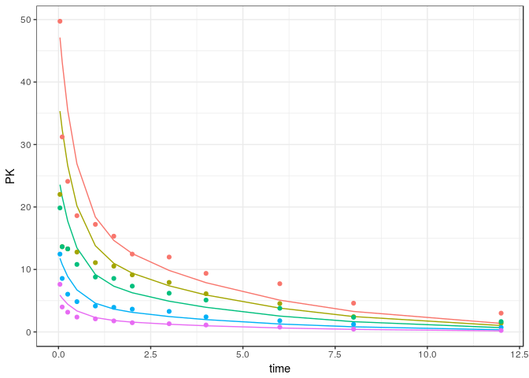

mrgsolvetk
==========

A toolkit to be used with `mrgsolve`

Examples
========

``` r
library(dplyr)
library(mrgsolve)
library(mrgsolvetk)
library(dmutate)

mod <- mread_cache("pk1cmt",modlib())
mod <- ev(mod, amt=100) %>% Req(CP)

param(mod)
```

    . 
    .  Model parameters (N=6):
    .  name value . name value
    .  CL   1     | KM   2    
    .  KA1  1     | VC   20   
    .  KA2  1     | VMAX 0

Sensitivity analyses
--------------------

### `sens_unif`

-   Draw parameters from uniform distribution based on current parameter values
-   `lower` and `upper` scale the parameter value to provide `a` and `b` arguments to `runif`

``` r
mod %>% 
  select(CL,VC,KA1) %>%
  sens_unif(.n=10, lower=0.2, upper=3)
```

    . # A tibble: 250 x 8
    .       ID  time    CP    CL    VC   KA1 name         value
    .    <dbl> <dbl> <dbl> <dbl> <dbl> <dbl> <chr>        <dbl>
    .  1  1.00  0    0      2.28  47.8 0.629 multivariate  1.00
    .  2  1.00  1.00 0.952  2.28  47.8 0.629 multivariate  1.00
    .  3  1.00  2.00 1.41   2.28  47.8 0.629 multivariate  1.00
    .  4  1.00  3.00 1.62   2.28  47.8 0.629 multivariate  1.00
    .  5  1.00  4.00 1.69   2.28  47.8 0.629 multivariate  1.00
    .  6  1.00  5.00 1.69   2.28  47.8 0.629 multivariate  1.00
    .  7  1.00  6.00 1.65   2.28  47.8 0.629 multivariate  1.00
    .  8  1.00  7.00 1.59   2.28  47.8 0.629 multivariate  1.00
    .  9  1.00  8.00 1.53   2.28  47.8 0.629 multivariate  1.00
    . 10  1.00  9.00 1.47   2.28  47.8 0.629 multivariate  1.00
    . # ... with 240 more rows

### `sens_norm`

-   Draw parameters from (log) normal distribution based on current parameter values and `%CV`

``` r
mod %>% 
  select(CL,VC) %>%
  sens_norm(.n=10, cv=30)
```

    . # A tibble: 250 x 7
    .       ID  time    CP    CL    VC name         value
    .    <dbl> <dbl> <dbl> <dbl> <dbl> <chr>        <dbl>
    .  1  1.00  0     0     2.11  18.5 multivariate  1.00
    .  2  1.00  1.00  3.20  2.11  18.5 multivariate  1.00
    .  3  1.00  2.00  4.03  2.11  18.5 multivariate  1.00
    .  4  1.00  3.00  4.03  2.11  18.5 multivariate  1.00
    .  5  1.00  4.00  3.75  2.11  18.5 multivariate  1.00
    .  6  1.00  5.00  3.41  2.11  18.5 multivariate  1.00
    .  7  1.00  6.00  3.06  2.11  18.5 multivariate  1.00
    .  8  1.00  7.00  2.74  2.11  18.5 multivariate  1.00
    .  9  1.00  8.00  2.44  2.11  18.5 multivariate  1.00
    . 10  1.00  9.00  2.18  2.11  18.5 multivariate  1.00
    . # ... with 240 more rows

### `sens_seq`

-   Give a sequence for one or more parameters

``` r
mod %>% sens_seq(CL = seq(2,12,2), VC = seq(30,100,10))
```

    . # A tibble: 364 x 5
    .       ID  time    CP param value
    .    <dbl> <dbl> <dbl> <chr> <dbl>
    .  1  1.00  0     0    CL     2.00
    .  2  1.00  0     0    CL     2.00
    .  3  1.00  1.00  2.98 CL     2.00
    .  4  1.00  2.00  3.80 CL     2.00
    .  5  1.00  3.00  3.84 CL     2.00
    .  6  1.00  4.00  3.62 CL     2.00
    .  7  1.00  5.00  3.33 CL     2.00
    .  8  1.00  6.00  3.04 CL     2.00
    .  9  1.00  7.00  2.75 CL     2.00
    . 10  1.00  8.00  2.49 CL     2.00
    . # ... with 354 more rows

### `sens_spaced`

-   Create sets of parameters equally-spaced between two bounds

``` r
mod %>%
  select(CL,VC) %>%
  sens_spaced(.n = 5, .factor = 4)
```

    . # A tibble: 250 x 5
    .       ID  time    CP name  value
    .    <dbl> <dbl> <dbl> <chr> <dbl>
    .  1  1.00  0     0    CL    0.250
    .  2  1.00  1.00  3.14 CL    0.250
    .  3  1.00  2.00  4.25 CL    0.250
    .  4  1.00  3.00  4.62 CL    0.250
    .  5  1.00  4.00  4.72 CL    0.250
    .  6  1.00  5.00  4.72 CL    0.250
    .  7  1.00  6.00  4.68 CL    0.250
    .  8  1.00  7.00  4.63 CL    0.250
    .  9  1.00  8.00  4.58 CL    0.250
    . 10  1.00  9.00  4.52 CL    0.250
    . # ... with 240 more rows

or

``` r
mod %>%
  sens_spaced(.n = 5, .factor = 4, CL = c(0.4, 1.5), VC = c(10,50))
```

    . # A tibble: 750 x 5
    .       ID  time    CP name  value
    .    <dbl> <dbl> <dbl> <chr> <dbl>
    .  1  1.00  0     0    CL    0.250
    .  2  1.00  1.00  3.14 CL    0.250
    .  3  1.00  2.00  4.25 CL    0.250
    .  4  1.00  3.00  4.62 CL    0.250
    .  5  1.00  4.00  4.72 CL    0.250
    .  6  1.00  5.00  4.72 CL    0.250
    .  7  1.00  6.00  4.68 CL    0.250
    .  8  1.00  7.00  4.63 CL    0.250
    .  9  1.00  8.00  4.58 CL    0.250
    . 10  1.00  9.00  4.52 CL    0.250
    . # ... with 740 more rows

### `sens_grid`

-   Like `sens_seq` but performs all combinations

``` r
mod %>%  sens_grid(CL = seq(1,10,1), VC = seq(20,40,5))
```

    . # A tibble: 1,250 x 7
    .       ID  time    CP    CL    VC name         value
    .    <dbl> <dbl> <dbl> <dbl> <dbl> <chr>        <dbl>
    .  1  1.00  0     0     1.00  20.0 multivariate  1.00
    .  2  1.00  1.00  3.07  1.00  20.0 multivariate  1.00
    .  3  1.00  2.00  4.05  1.00  20.0 multivariate  1.00
    .  4  1.00  3.00  4.27  1.00  20.0 multivariate  1.00
    .  5  1.00  4.00  4.21  1.00  20.0 multivariate  1.00
    .  6  1.00  5.00  4.06  1.00  20.0 multivariate  1.00
    .  7  1.00  6.00  3.89  1.00  20.0 multivariate  1.00
    .  8  1.00  7.00  3.70  1.00  20.0 multivariate  1.00
    .  9  1.00  8.00  3.53  1.00  20.0 multivariate  1.00
    . 10  1.00  9.00  3.36  1.00  20.0 multivariate  1.00
    . # ... with 1,240 more rows

### `sens_covset`

-   Use `dmutate` to generate random variates for each parameter

``` r
cov1 <- dmutate::covset(CL ~ runif(1,3.5), VC[0,] ~ rnorm(50,25))

cov1
```

    .  Formulae                 
    .    CL ~ runif(1, 3.5)     
    .    VC[0, ] ~ rnorm(50, 25)

``` r
out <- mod %>% sens_covset(cov1) 
```

``` r
out
```

    . # A tibble: 2,500 x 5
    .       ID  time    CP    CL    VC
    .    <dbl> <dbl> <dbl> <dbl> <dbl>
    .  1  1.00  0    0      3.29  66.5
    .  2  1.00  1.00 0.924  3.29  66.5
    .  3  1.00  2.00 1.22   3.29  66.5
    .  4  1.00  3.00 1.29   3.29  66.5
    .  5  1.00  4.00 1.27   3.29  66.5
    .  6  1.00  5.00 1.22   3.29  66.5
    .  7  1.00  6.00 1.17   3.29  66.5
    .  8  1.00  7.00 1.12   3.29  66.5
    .  9  1.00  8.00 1.06   3.29  66.5
    . 10  1.00  9.00 1.01   3.29  66.5
    . # ... with 2,490 more rows

``` r
distinct(out,ID,CL,VC)
```

    . # A tibble: 100 x 3
    .       ID    CL    VC
    .    <dbl> <dbl> <dbl>
    .  1  1.00  3.29  66.5
    .  2  2.00  3.20  35.1
    .  3  3.00  1.86  34.4
    .  4  4.00  3.30  57.6
    .  5  5.00  1.59  14.3
    .  6  6.00  1.60  28.6
    .  7  7.00  1.98  25.9
    .  8  8.00  2.38  54.1
    .  9  9.00  1.49  69.2
    . 10 10.0   2.83  92.9
    . # ... with 90 more rows

Estimation `stats::optim`
=========================

Load a data set
---------------

``` r
data(exTheoph)
df <- mutate(exTheoph, DV = conc)
```

Load a model
------------

``` r
mod <- mread("pk1cmt", modlib())
```

Define an objective function
----------------------------

-   This could be anything

``` r
ofv <- function(dv,pred,par) -1*sum(dnorm(dv,pred,par$sigma,log=TRUE))
```

Define parameters to estimate
-----------------------------

``` r
library(optimhelp)
par <- parset(log_par("CL", 0.1),
              log_par("VC", 1.1),
              log_par("KA1",1.1),
              log_par("sigma",1))
```

Fit
---

-   The workflow is the same as when we simulate
    -   Get the model ready
    -   Define the dta set
    -   Pipe to `fit_optim` rather than `mrgsim`
-   Here, just fit `ID==3`

``` r
fit <- 
  mod %>% 
  data_set(df, ID==3) %>%
  fit_optim(pred="CP",ofv=ofv,par=par)
```

``` r
fit$pars
```

    .   name     value transf tr fx
    .     CL 0.0395583    log  u   
    .     VC 0.4858379    log  u   
    .    KA1 2.4536472    log  u   
    .  sigma 0.2089564    log  u

Plot
----

``` r
library(ggplot2)
ggplot(data=fit$tab) + 
  geom_point(aes(time,conc)) +
  geom_line(aes(time,PRED)) 
```



With fixed parameter
--------------------

``` r
library(optimhelp)
par <- parset(log_par("CL", 0.1),
              log_par("VC", 1.1),
              log_par("KA1",1.9,fixed=TRUE),
              log_par("sigma",1))
```

Fit
---

``` r
fitt <- 
  mod %>% 
  data_set(df, ID==3) %>%
  fit_optim(pred="CP",ofv=ofv,par=par)
```

``` r
fitt$pars
```

    .   name      value transf tr fx
    .     CL 0.04190059    log  u   
    .     VC 0.45512514    log  u   
    .    KA1 1.90000000    log  u  *
    .  sigma 0.35140850    log  u

``` r
fit$value
```

    . [1] -1.470963

``` r
fitt$value
```

    . [1] 3.732531
