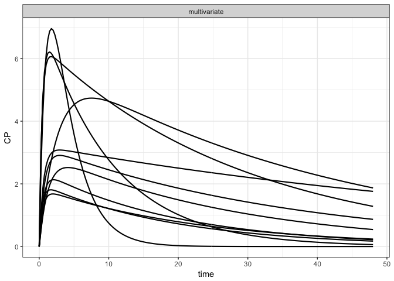
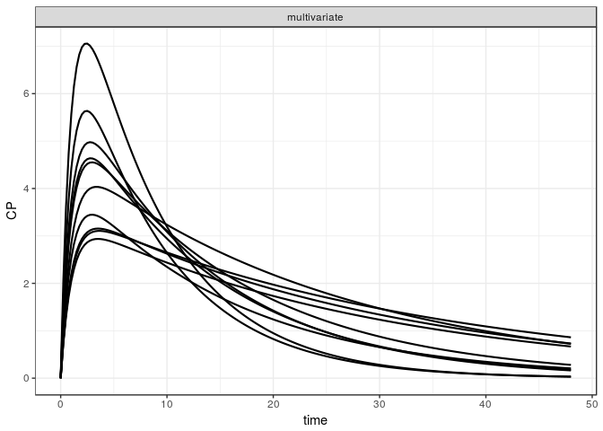
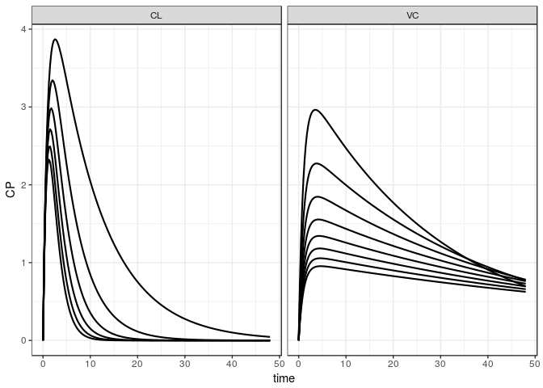

mrgsolvetk
==========

A toolkit to be used with `mrgsolve`

Examples
========

``` r
library(ggplot2)
library(dplyr)
library(mrgsolve)
library(mrgsolvetk)

mod <- mread_cache("pk1cmt",modlib())

mod <- ev(mod, amt=100) %>% Req(CP) %>% update(end = 48, delta = 0.25)

param(mod)
```

    . 
    .  Model parameters (N=6):
    .  name value . name value
    .  CL   1     | KM   2    
    .  KA1  1     | VC   20   
    .  KA2  1     | VMAX 0

Sensitivity analyses
--------------------

### `sens_unif`

-   Draw parameters from uniform distribution based on current parameter values
-   `lower` and `upper` scale the parameter value to provide `a` and `b` arguments to `runif`

``` r
out <- 
  mod %>% 
  select(CL,VC,KA1) %>%
  sens_unif(.n=10, lower=0.2, upper=3)

out
```

    . # A tibble: 1,930 x 8
    .       ID  time    CP    CL    VC   KA1 name         value
    .    <dbl> <dbl> <dbl> <dbl> <dbl> <dbl> <chr>        <dbl>
    .  1    1. 0.    0.     2.12  42.3  1.78 multivariate    1.
    .  2    1. 0.250 0.845  2.12  42.3  1.78 multivariate    1.
    .  3    1. 0.500 1.38   2.12  42.3  1.78 multivariate    1.
    .  4    1. 0.750 1.71   2.12  42.3  1.78 multivariate    1.
    .  5    1. 1.00  1.91   2.12  42.3  1.78 multivariate    1.
    .  6    1. 1.25  2.02   2.12  42.3  1.78 multivariate    1.
    .  7    1. 1.50  2.09   2.12  42.3  1.78 multivariate    1.
    .  8    1. 1.75  2.12   2.12  42.3  1.78 multivariate    1.
    .  9    1. 2.00  2.13   2.12  42.3  1.78 multivariate    1.
    . 10    1. 2.25  2.13   2.12  42.3  1.78 multivariate    1.
    . # ... with 1,920 more rows

``` r
sens_plot(out, CP)
```



We can also make a univariate version of this

``` r
mod %>% 
  select(CL,VC,KA1) %>%
  sens_unif(.n=10, lower=0.2, upper=3, univariate = TRUE) %>%
  sens_plot(CP, split = TRUE)
```

    . $CL


    . 
    . $KA1


    . 
    . $VC


### `sens_norm`

-   Draw parameters from (log) normal distribution based on current parameter values and `%CV`

``` r
mod %>% 
  select(CL,VC) %>%
  sens_norm(.n=10, cv=30) %>%
  sens_plot(CP)
```


### `sens_seq`

-   Give a sequence for one or more parameters

``` r
mod %>% sens_seq(CL = seq(2,12,2), VC = seq(30,100,10)) %>% sens_plot(CP)
```



### `sens_range`

-   Create sets of parameters equally-spaced between two bounds

``` r
mod %>%
  select(CL,VC) %>%
  sens_range(.n = 5, .factor = 4) %>%
  sens_plot(CP, split = TRUE)
```

    . $CL



    . 
    . $VC


or

``` r
mod %>%
  sens_range(CL = c(0.5, 1.5), VC = c(10,40), .n = 5) %>%
  sens_plot(CP)
```


### `sens_grid`

-   Like `sens_seq` but performs all combinations

``` r
mod %>%  sens_grid(CL = seq(1,10,1), VC = seq(20,40,5)) %>% sens_plot(CP)
```


### `sens_covset`

-   Use `dmutate` to generate random variates for each parameter

``` r
cov1 <- dmutate::covset(CL ~ runif(1,3.5), VC[0,] ~ rnorm(50,25))

cov1
```

    .  Formulae                 
    .    CL ~ runif(1, 3.5)     
    .    VC[0, ] ~ rnorm(50, 25)

``` r
out <- mod %>% sens_covset(cov1) 
```

``` r
out
```

    . # A tibble: 19,300 x 7
    .       ID  time    CP    CL    VC name         value
    .    <dbl> <dbl> <dbl> <dbl> <dbl> <chr>        <dbl>
    .  1    1. 0.     0.    1.31  15.0 multivariate    1.
    .  2    1. 0.250  1.45  1.31  15.0 multivariate    1.
    .  3    1. 0.500  2.55  1.31  15.0 multivariate    1.
    .  4    1. 0.750  3.38  1.31  15.0 multivariate    1.
    .  5    1. 1.00   3.99  1.31  15.0 multivariate    1.
    .  6    1. 1.25   4.44  1.31  15.0 multivariate    1.
    .  7    1. 1.50   4.76  1.31  15.0 multivariate    1.
    .  8    1. 1.75   4.99  1.31  15.0 multivariate    1.
    .  9    1. 2.00   5.13  1.31  15.0 multivariate    1.
    . 10    1. 2.25   5.22  1.31  15.0 multivariate    1.
    . # ... with 19,290 more rows

``` r
distinct(out,ID,CL,VC)
```

    . # A tibble: 100 x 3
    .       ID    CL    VC
    .    <dbl> <dbl> <dbl>
    .  1    1.  1.31  15.0
    .  2    2.  1.60  44.3
    .  3    3.  1.04  27.0
    .  4    4.  1.83  29.2
    .  5    5.  1.27  54.3
    .  6    6.  2.82  32.2
    .  7    7.  2.70  56.6
    .  8    8.  1.65  25.3
    .  9    9.  3.49  29.0
    . 10   10.  2.07  30.6
    . # ... with 90 more rows

\`
