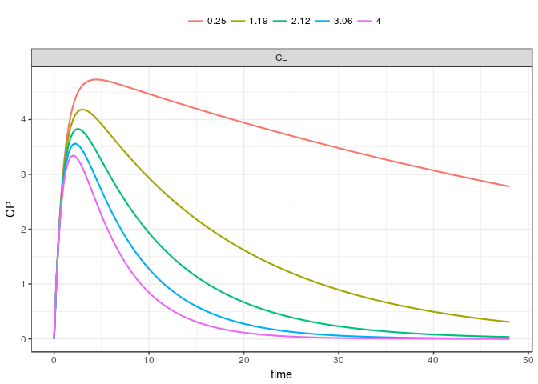

mrgsolvetk
==========

A toolkit to be used with `mrgsolve`

Examples
========

``` r
library(ggplot2)
library(dplyr)
library(mrgsolve)
library(mrgsolvetk)

mod <- mread_cache("pk1cmt",modlib())

mod <- ev(mod, amt=100) %>% Req(CP) %>% update(end = 48, delta = 0.25)

param(mod)
```

    . 
    .  Model parameters (N=6):
    .  name value . name value
    .  CL   1     | KM   2    
    .  KA1  1     | VC   20   
    .  KA2  1     | VMAX 0

Sensitivity analyses
--------------------

### `sens_unif`

-   Draw parameters from uniform distribution based on current parameter values
-   `lower` and `upper` scale the parameter value to provide `a` and `b` arguments to `runif`

``` r
out <- 
  mod %>% 
  select(CL,VC,KA1) %>%
  sens_unif(.n=10, lower=0.2, upper=3)

out
```

    . # A tibble: 1,930 x 8
    .       ID  time    CP    CL    VC   KA1 name         value
    .    <dbl> <dbl> <dbl> <dbl> <dbl> <dbl> <chr>        <dbl>
    .  1    1. 0.    0.     1.60  45.1  1.15 multivariate    1.
    .  2    1. 0.250 0.553  1.60  45.1  1.15 multivariate    1.
    .  3    1. 0.500 0.963  1.60  45.1  1.15 multivariate    1.
    .  4    1. 0.750 1.26   1.60  45.1  1.15 multivariate    1.
    .  5    1. 1.00  1.49   1.60  45.1  1.15 multivariate    1.
    .  6    1. 1.25  1.65   1.60  45.1  1.15 multivariate    1.
    .  7    1. 1.50  1.76   1.60  45.1  1.15 multivariate    1.
    .  8    1. 1.75  1.85   1.60  45.1  1.15 multivariate    1.
    .  9    1. 2.00  1.90   1.60  45.1  1.15 multivariate    1.
    . 10    1. 2.25  1.94   1.60  45.1  1.15 multivariate    1.
    . # ... with 1,920 more rows

``` r
ggplot(out, aes(time, CP, group = ID, col = VC)) + geom_line()
```


We can also make a univariate version of this

``` r
out <- 
  mod %>% 
  select(CL,VC,KA1) %>%
  sens_unif(.n=10, lower=0.2, upper=3, univariate = TRUE)

out
```

    . # A tibble: 5,790 x 5
    .       ID  time    CP name  value
    .    <dbl> <dbl> <dbl> <chr> <dbl>
    .  1    1. 0.     0.   CL     2.52
    .  2    1. 0.250  1.09 CL     2.52
    .  3    1. 0.500  1.90 CL     2.52
    .  4    1. 0.750  2.50 CL     2.52
    .  5    1. 1.00   2.94 CL     2.52
    .  6    1. 1.25   3.25 CL     2.52
    .  7    1. 1.50   3.46 CL     2.52
    .  8    1. 1.75   3.59 CL     2.52
    .  9    1. 2.00   3.67 CL     2.52
    . 10    1. 2.25   3.71 CL     2.52
    . # ... with 5,780 more rows

``` r
ggplot(out, aes(time, CP, group = ID)) + 
  geom_line() + facet_wrap(~name)
```


### `sens_norm`

-   Draw parameters from (log) normal distribution based on current parameter values and `%CV`

``` r
mod %>% 
  select(CL,VC) %>%
  sens_norm(.n=10, cv=30)
```

    . # A tibble: 1,930 x 7
    .       ID  time    CP    CL    VC name         value
    .    <dbl> <dbl> <dbl> <dbl> <dbl> <chr>        <dbl>
    .  1    1. 0.    0.     1.16  34.5 multivariate    1.
    .  2    1. 0.250 0.639  1.16  34.5 multivariate    1.
    .  3    1. 0.500 1.13   1.16  34.5 multivariate    1.
    .  4    1. 0.750 1.51   1.16  34.5 multivariate    1.
    .  5    1. 1.00  1.80   1.16  34.5 multivariate    1.
    .  6    1. 1.25  2.02   1.16  34.5 multivariate    1.
    .  7    1. 1.50  2.19   1.16  34.5 multivariate    1.
    .  8    1. 1.75  2.31   1.16  34.5 multivariate    1.
    .  9    1. 2.00  2.40   1.16  34.5 multivariate    1.
    . 10    1. 2.25  2.47   1.16  34.5 multivariate    1.
    . # ... with 1,920 more rows

### `sens_seq`

-   Give a sequence for one or more parameters

``` r
mod %>% sens_seq(CL = seq(2,12,2), VC = seq(30,100,10))
```

    . # A tibble: 2,716 x 5
    .       ID  time    CP name  value
    .    <dbl> <dbl> <dbl> <chr> <dbl>
    .  1    1. 0.     0.   CL       2.
    .  2    1. 0.     0.   CL       2.
    .  3    1. 0.250  1.09 CL       2.
    .  4    1. 0.500  1.91 CL       2.
    .  5    1. 0.750  2.53 CL       2.
    .  6    1. 1.00   2.98 CL       2.
    .  7    1. 1.25   3.31 CL       2.
    .  8    1. 1.50   3.54 CL       2.
    .  9    1. 1.75   3.70 CL       2.
    . 10    1. 2.00   3.80 CL       2.
    . # ... with 2,706 more rows

### `sens_range`

-   Create sets of parameters equally-spaced between two bounds

``` r
mod %>%
  select(CL,VC) %>%
  sens_range(.n = 5, .factor = 4)
```

    . # A tibble: 1,930 x 5
    .       ID  time    CP name  value
    .    <dbl> <dbl> <dbl> <chr> <dbl>
    .  1    1. 0.     0.   CL    0.250
    .  2    1. 0.250  1.10 CL    0.250
    .  3    1. 0.500  1.96 CL    0.250
    .  4    1. 0.750  2.62 CL    0.250
    .  5    1. 1.00   3.14 CL    0.250
    .  6    1. 1.25   3.53 CL    0.250
    .  7    1. 1.50   3.84 CL    0.250
    .  8    1. 1.75   4.07 CL    0.250
    .  9    1. 2.00   4.25 CL    0.250
    . 10    1. 2.25   4.39 CL    0.250
    . # ... with 1,920 more rows

or

``` r
out <- 
  mod %>%
  sens_range(CL = c(0.5, 1.5), VC = c(10,40), .n = 5)

ggplot(out, aes(time,CP, group = ID)) + geom_line() + facet_wrap(~name)
```



### `sens_grid`

-   Like `sens_seq` but performs all combinations

``` r
mod %>%  sens_grid(CL = seq(1,10,1), VC = seq(20,40,5))
```

    . # A tibble: 9,650 x 7
    .       ID  time    CP    CL    VC name         value
    .    <dbl> <dbl> <dbl> <dbl> <dbl> <chr>        <dbl>
    .  1    1. 0.     0.      1.   20. multivariate    1.
    .  2    1. 0.250  1.10    1.   20. multivariate    1.
    .  3    1. 0.500  1.94    1.   20. multivariate    1.
    .  4    1. 0.750  2.58    1.   20. multivariate    1.
    .  5    1. 1.00   3.07    1.   20. multivariate    1.
    .  6    1. 1.25   3.44    1.   20. multivariate    1.
    .  7    1. 1.50   3.71    1.   20. multivariate    1.
    .  8    1. 1.75   3.91    1.   20. multivariate    1.
    .  9    1. 2.00   4.05    1.   20. multivariate    1.
    . 10    1. 2.25   4.15    1.   20. multivariate    1.
    . # ... with 9,640 more rows

### `sens_covset`

-   Use `dmutate` to generate random variates for each parameter

``` r
cov1 <- dmutate::covset(CL ~ runif(1,3.5), VC[0,] ~ rnorm(50,25))

cov1
```

    .  Formulae                 
    .    CL ~ runif(1, 3.5)     
    .    VC[0, ] ~ rnorm(50, 25)

``` r
out <- mod %>% sens_covset(cov1) 
```

``` r
out
```

    . # A tibble: 19,300 x 7
    .       ID  time    CP    CL    VC name         value
    .    <dbl> <dbl> <dbl> <dbl> <dbl> <chr>        <dbl>
    .  1    1. 0.    0.     2.37  46.1 multivariate    1.
    .  2    1. 0.250 0.477  2.37  46.1 multivariate    1.
    .  3    1. 0.500 0.842  2.37  46.1 multivariate    1.
    .  4    1. 0.750 1.12   2.37  46.1 multivariate    1.
    .  5    1. 1.00  1.33   2.37  46.1 multivariate    1.
    .  6    1. 1.25  1.49   2.37  46.1 multivariate    1.
    .  7    1. 1.50  1.61   2.37  46.1 multivariate    1.
    .  8    1. 1.75  1.69   2.37  46.1 multivariate    1.
    .  9    1. 2.00  1.76   2.37  46.1 multivariate    1.
    . 10    1. 2.25  1.80   2.37  46.1 multivariate    1.
    . # ... with 19,290 more rows

``` r
distinct(out,ID,CL,VC)
```

    . # A tibble: 100 x 3
    .       ID    CL    VC
    .    <dbl> <dbl> <dbl>
    .  1    1.  2.37 46.1 
    .  2    2.  2.95 32.5 
    .  3    3.  2.84 29.8 
    .  4    4.  3.22 80.9 
    .  5    5.  2.99 35.3 
    .  6    6.  1.89 54.3 
    .  7    7.  2.48  4.35
    .  8    8.  1.16 42.1 
    .  9    9.  2.13 47.9 
    . 10   10.  3.34 78.9 
    . # ... with 90 more rows

\`
