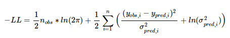

```{r,echo=FALSE}
knitr::opts_chunk$set(comment='.', message=FALSE, 
                      fig.path="../../inst/maintenance/img/mrgoptim_example-")
```


# Optimizing Parameters of a PK/PD Model

## Load packages
```{r warning=FALSE}
library(ggplot2)
library(dplyr)
library(mrgsolve)
library(mrgsolvetk)

theme_set(theme_bw())

```

## Maximum Likelihood Parameter Optimization

### Objective function (Negative Log Likelihood):



### `mrgoptim`
`mrgoptim` uses the `newuoa` search algorithm, or any of the algorithms in base R's `optim`, 
to optimize parameter values by minimizing the above equation.

This example shows a simultaneous fit of PK and PD data from five dose levels.

#### Data structure
The data to be fit is an mrgsolve data_set. Required columns for fitting are:

- ID	
- time	
- evid
- cmt
- amt
- dv	


```{r}
data <- read.csv("../../inst/maintenance/data/optim-example.csv")

head(data)
```

Plot the data to get an idea of the profiles to be fit. cmt 1 is plasma concentration
data and cmt 2 is PD data

```{r warning=FALSE}
ggplot(data, aes(x = time, y = dv, color = as.factor(ID))) +
  geom_point() +
  geom_line() +
  facet_wrap("cmt") +
  guides(color = FALSE)
```

The following model will be fit to these data:

- PK: 2 compartment model
- PD: Inhibitory Emax model with baseline
- Proportional error models for both PK and PD

```{r}
code<-"
$PROB 2 cmt PK Model, Emax PD model

$PARAM
CL=10
VC = 20
VP = 20
Q=20
Emax = 60
BL = 50
EC50 = 10
gamma =1
sigma1 = 0.1
sigma2 = 0.1

$CMT X1 X2 

$ODE
dxdt_X1 = -(Q+CL)/VC*X1+Q/VP*X2;
dxdt_X2 = Q/VC*X1-Q/VP*X2;

$TABLE
capture PK = X1/VC;
capture varPK = (PK*sigma1)*(PK*sigma1);


capture PD = BL-(pow(PK,gamma)*Emax)/(pow(PK,gamma)+pow(EC50,gamma));
capture varPD = (PD*sigma2)*(PD*sigma2);

capture ipred = NAN;
capture var = NAN; 

if(self.cmt == 1) {
   ipred = PK;
   var = varPK;
}

if(self.cmt == 2) {
   ipred = PD;
   var = varPD;
}"

mod <- mcode("2cmtPK-Emax", code)
```

Here, the predicted plasma concentrations, response, and variances were captured in
the **PK**, **PD**, **varPK**, and **varPD**  outputs, respectively. Predictions 
and variances are consolidated to a single column each. If cmt == 1 the predicted 
output, `ipred`, will be **PK** and the prediction variance, `var`, will be **varPK**. If cmt == 2 the 
predicted output will be **PD** and prediction variance **varPD**.

Let's check how the initial parameter values fit the data. 

```{r warning=FALSE}
out <- mod %>%
  data_set(data) %>%
  carry.out(cmt, dv) %>%
  obsonly() %>%
  mrgsim() %>%
  as.data.frame()

ggplot(filter(out, cmt == 1), aes(x = time, y = ipred, color = as.factor(ID))) +
  geom_line() +
  geom_point(aes(y = dv)) +
  guides(color = FALSE)

ggplot(filter(out, cmt == 2), aes(x = time, y = ipred, color = as.factor(ID))) +
  geom_line() +
  geom_point(aes(y = dv)) +
  guides(color = FALSE)

```

Not terrible, should be good enough for initial estimates.

Now let's use `mrgoptim` to optimize the parameters and return parameter estimates and precision.
Use the `output`, and `var` arguments to specify which columns in the model code correspond to the predicted values and variances. Specify which system parameters to optimize with the `prms` argument and variance parameters with the `v_prms` arguments. 

```{r echo=T, results='hide'}
fit <- mod %>%
  data_set(data) %>%
  mrgoptim(output = "ipred",
           var = "var",
           prms = c("CL",
                    "VC",
                    "VP",
                    "Q",
                    "Emax",
                    "BL",
                    "EC50",
                    "gamma"),
           v_prms = c("sigma1", "sigma2"),
           method = "newuoa")

```
The function returns a list with some information about the optimization, the final objective function value (-LL), final parameter estimates, covariance and correlation matrices, CV percent, and the output dataset.

```{r}
print(fit)

```
Lets check how the optimized parameters fit the data. 
```{r warning=FALSE}
out_fit <- mod %>%
  param(fit$par) %>%
  carry.out(cmt, dv) %>%
  data_set(data) %>%
  obsonly() %>%
  mrgsim() %>%
  as.data.frame()


ggplot(filter(out_fit, cmt == 1), aes(x = time, y = ipred, color = as.factor(ID))) +
  geom_line() +
  geom_point(aes(y = dv)) +
  guides(color = FALSE)

ggplot(filter(out_fit, cmt == 2), aes(x = time, y = ipred, color = as.factor(ID))) +
  geom_line() +
  geom_point(aes(y = dv)) +
  guides(color = FALSE)


```
